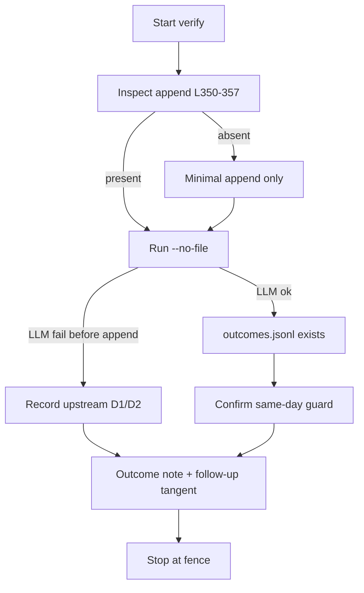

# Verify strategic_outcomes.jsonl always-write fix actually landed

## Why
Ledger next-step `memory-knowledge:outcomes-always-write` is marked **done** (completed 2026-08-24) and governance historically claimed a touch on `strategic_outcomes.jsonl`, but live signals still report the file missing. A claimed-done write that never produces an artifact is the failure mode this pipeline exists to catch. Closing it cleanly either proves the always-append path is live, or proves with artifacts that the 08-24 land is real and a **different** defect blocks creation (so ledger "done" is not a lie about the append code, and a follow-up tangent owns the real gap).

## Done when
- [ ] `C:\Users\lkmot\.factory\scripts\strategic_review.py` always-append path cited as present or absent with **exact line numbers** (OUTCOMES_PATH + append call + preceding early-exit gates) in the outcome note
- [ ] One controlled proof run executed: `python C:\Users\lkmot\.factory\scripts\strategic_review.py --no-file` (spend allowed under existing strategic-review budget gate); stdout/stderr captured under `coo/tmp/20260905-strategic-outcomes-verify.run.log`
- [ ] Post-run artifact check recorded:
  - If LLM path succeeds: `C:\Users\lkmot\.factory\knowledge\strategic_outcomes.jsonl` **exists** and last row `run_id` matches today's `strategic-review-YYYYMMDD`
  - If LLM path fails **before** append: outcome note must include measured evidence (HTTP/`finish_reason`/token usage or parse error) proving failure is upstream of L350–357, and must **not** claim the append fix is missing
- [ ] Same-day idempotency guard confirmed with a check artifact at `coo/tmp/20260905-strategic-outcomes-verify.guard-check.{py,out}`: import/call `_same_day_run_exists` against a known historical `run_id` (expect True) and a never-seen id (expect False); if a proposals row for today exists, a second full run must print the skip message and not append a second proposals set
- [ ] Final outcome note written at `coo/outcomes/20260905-strategic-outcomes-verify.md` with scoreboard, root-cause class (append-missing vs upstream-LLM vs schedule-never-ran), and explicit follow-up recommendation if D1/D2 still blocks
- [ ] If and only if always-append code is **absent**: minimal patch restoring unconditional `_append_jsonl(OUTCOMES_PATH, …)` only; diff summarized in outcome note; then re-run proof. No other code changes.

## Out of scope
- Raising `REVIEW_AGENT["max_tokens"]`, length-finish retries, or any LLM-client hardening (D1/D2) — **own tangent** if still open
- `utf-8-sig` / BOM fix for `_load_jsonl` — own micro-tangent
- Re-enabling Task Scheduler `\Factory-Strategic-Review` or un-archiving the Sunday schedule
- Editing proposal content, filing GitHub issues (use `--no-file` for proof runs), mass email, production deploys, DNS/network changes, data deletion
- Rewriting `strategic_review.py` beyond the minimal always-append restoration if code is absent
- Mutating `project-ledger.json` status fields without operator approval (recommend only)

## Context (verified during scoping)
Machine: **Legion**. Paths live under `C:\Users\lkmot\.factory\…` and repo `C:\Users\lkmot\factory-context\code\fleet-triage`.

**Filesystem (live):**
- `strategic_review.py` **exists** (`~\.factory\scripts\strategic_review.py`, 401 lines, 16,054 bytes)
- `strategic_proposals.jsonl` **exists** (4 rows, all `run_id=strategic-review-20260809`; last row filed=True)
- `strategic_outcomes.jsonl` **MISSING**
- Prior executor artifacts already on disk:
  - `coo/outcomes/20260905-strategic-outcomes-verify.md` (partial, escalate-met)
  - `coo/tmp/20260905-strategic-outcomes-verify.{probe,diagnostic,guard-check}.py`
  - empty `coo/tmp/20260905-strategic-outcomes-verify.scoped.txt` (prior scope failure marker)

**Code inspection (re-read this scope):**
- L48–49: `PROPOSALS_PATH` / `OUTCOMES_PATH` under KNOWLEDGE
- L57: `max_tokens: 4096` for `deepseek-v4-pro`
- L67–78: `_load_jsonl` reads with plain `utf-8` (BOM side-risk: proposals row 1 dropped silently)
- L81–84: `_append_jsonl` — unconditionally appends when called
- L96–98: `_same_day_run_exists` over **all** proposals rows
- L295–297: same-day guard only fires when `not dry_run and not no_file`
- L309–330 early exits **before** append: `--dry-run`, missing key, `if not result: return 1`
- L350–357: **always-append IS PRESENT** (`_append_jsonl(OUTCOMES_PATH, {ts, run_id, assessments, no_prior_to_assess})`)
- Therefore the append code landed, but is **unreachable** if `_call_llm` returns falsy on truncated/empty content (D2), which the prior cycle measured as D1 (`finish_reason=length`, 4096 completion tokens all spent on reasoning, `content_len: 0`, `json.loads("")` exit 1)

**Ledger / decisions:**
- `project-ledger.json` blockers on this project: `outcomes-phantom` and `strategic-dupe`, both since 2026-08-09
- `next_steps` `memory-knowledge:outcomes-always-write` and `…:strategic-idempotency` both `status: done`, completed 2026-08-24
- `decisions.jsonl` 2026-09-06T02:34Z: prior cycle recorded append present + D1 starvation; patch rejected as fenced; alternatives considered and rejected on record

**Schedule:**
- `\Factory-Strategic-Review` Task Scheduler task = **Disabled** (Last Result 267011). Explains the prolonged `exists: False` signal: the 08-24 patch never got a healthy scheduled execution (automation archived ~2026-08-28 per SCHEDULES.md).

**Precedent:**
- `tangents.json`: **0** matching strategic/outcomes entries at scope time (no competing open tangent body).
- Prior cycle on **this same id** is the operative precedent: append verified present; `--no-file` run failed upstream of append (measured, not guessed); key/endpoint healthy via tiny probe; guard logic True on `strategic-review-20260809`, False on never-seen id; **no code patch applied** (fenced). Escalate condition already fired once.

**What is different this cycle:**
1. Executor must treat the prior outcome + diagnostic scripts as **starting evidence to re-verify**, not as license to expand into D1/D2 patches.
2. Success is split-branched: prove append code truth AND either create the file OR prove upstream blockage with a fresh run log — so this tangent can close honestly without absorbing the LLM budget bug.
3. If D1/D2 still blocks file creation, the outcome **must** hand off a recommended new tangent (id/title, e.g. `20260906-fix-strategic-review-llm-truncation`: max_tokens ≥ 8192, length/empty-finish failure record to outcomes, optional `utf-8-sig` decode) — do not implement it here.

**KB:** no service/capability rows for `strategic_review`; only the general BYOK note (reasoning models need generous max_tokens) in AGENTS.md applies.

## Approach sketch
1. Re-open `strategic_review.py`; confirm L49 / L350–357 / L295–297 / L328–330 still match (cite lines in outcome note).
2. Confirm pre-state: `Test-Path …\strategic_outcomes.jsonl` → expect False.
3. Run once: `python C:\Users\lkmot\.factory\scripts\strategic_review.py --no-file`, full console captured to `coo/tmp/20260905-strategic-outcomes-verify.run.log`. Do not spend a second LLM call on a confirmed length-starvation failure unless verifying a material environment change.
4. Branch:
   - **Success path:** assert outcomes file exists + parse last row's `run_id`; then confirm the same-day guard (import-level `_same_day_run_exists` check artifact; if a proposals row for today was written, a second full run must print the skip message and write no second proposals set).
   - **Failure path (expected if D1 unchanged):** do not patch; refresh diagnostic evidence only if the run log differs from prior measurements; document upstream failure class; leave `strategic_outcomes.jsonl` absent; mark "file created" as blocked-upstream (not append-absent).
5. If append code were absent (regression): apply **only** the unconditional outcomes `_append_jsonl` block, then re-run the proof.
6. Write/overwrite `coo/outcomes/20260905-strategic-outcomes-verify.md`: scoreboard, spend disclosure, root-cause class, recommended follow-up tangent, and an explicit judgment on whether ledger "done" remains fair for the append code specifically.
7. Stop at the fence. One failed cycle → escalate per header; do not improvise beyond it.

## Executor instructions (pipeline section)

You are the Executor for this tangent. Rules:

1. Work ONLY toward the "Done when" items. The "Out of scope" fence is HARD — if the
   real path crosses it, STOP and write a rescope note instead of improvising.
2. If you discover the contract itself is wrong (goal unachievable as written, a
   context pointer doesn't resolve), do a MID-FLIGHT BAIL: stop, write the rescope
   note, exit. Do not wander.
3. Stay inside this repo's working area and the paths the contract names. SFREP COM
   sessions are forbidden unless the contract explicitly authorizes them.
4. Before exiting, append to THIS FILE (tangents/<id>.md):

## Outcome (filled by executor)
- status: success | partial | failed (environmental: yes/no)
- artifacts: <paths produced>
- what was done: <2-4 lines>
- what remains: <or "nothing — done-when fully met">
- rescope note: <only if bailing>
run_started: 2026-09-05T21:39:29-05:00
