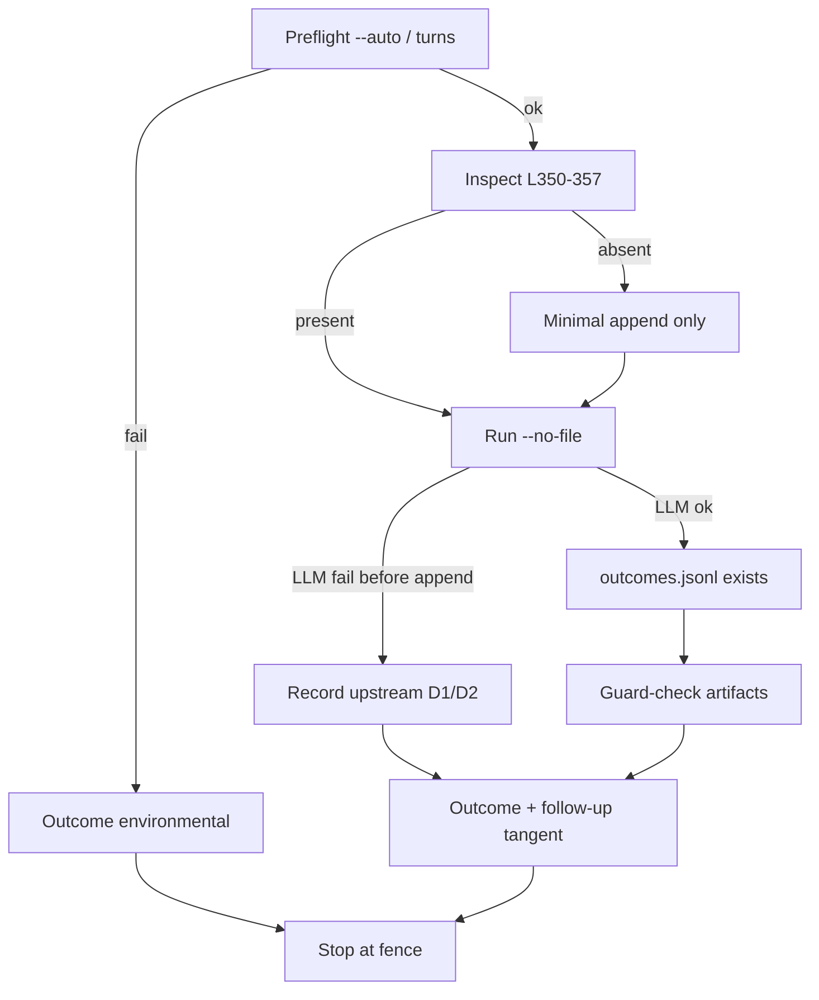

# Verify strategic_outcomes.jsonl always-write fix actually landed

## Why
Ledger next-step `memory-knowledge:outcomes-always-write` is marked **done** (completed 2026-08-24) while live metrics still report `outcomes_file_exists: False` and `strategic_outcomes.jsonl` is absent. A claimed-done write that never produces an artifact is the failure mode this pipeline exists to catch. This cycle closes the claim honestly: prove append code truth with line cites, run one controlled proof, classify root cause (append-missing vs upstream-LLM vs schedule-never-ran vs harness-gate), and hand off any remaining defect as its own tangent.

## Done when
- [ ] Preflight harness check recorded in outcome note: current execute path launches with `--auto` (cite `coo/coo-loop-v4.sh` EXEC_AUTO / execute lines) and this cycle's `coo/tmp/20260905-strategic-outcomes-verify.exec.log` final result is **not** `num_turns:0` / "insufficient permission". If preflight fails, stop (status partial/environmental), write outcome note, do not spend LLM.
- [ ] `C:\Users\lkmot\.factory\scripts\strategic_review.py` always-append path cited as present or absent with **exact line numbers** (OUTCOMES_PATH + append call + preceding early-exit gates + same-day guard) in `coo/outcomes/20260905-strategic-outcomes-verify.md`
- [ ] One controlled proof run: `python C:\Users\lkmot\.factory\scripts\strategic_review.py --no-file` (spend allowed under existing strategic-review budget gate); full stdout/stderr at `coo/tmp/20260905-strategic-outcomes-verify.run.log`
- [ ] Post-run artifact check recorded in the outcome note:
  - If LLM path succeeds: `C:\Users\lkmot\.factory\knowledge\strategic_outcomes.jsonl` **exists** and last row `run_id` matches today's `strategic-review-YYYYMMDD`
  - If LLM path fails **before** append: outcome note includes measured evidence (HTTP/`finish_reason`/token usage or parse error) proving failure is upstream of the append block, and must **not** claim the append fix is missing
- [ ] Same-day idempotency guard confirmed with check artifacts `coo/tmp/20260905-strategic-outcomes-verify.guard-check.py` and `coo/tmp/20260905-strategic-outcomes-verify.guard-check.out`: import/call `_same_day_run_exists` against known historical `run_id` `strategic-review-20260809` (expect True) and a never-seen id (expect False). If a proposals row for today exists after a successful full/write path, a second full run must print the skip message and not append a second proposals set (note: same-day guard does **not** fire under `--no-file`; do not claim full-run skip from a `--no-file`-only path)
- [ ] Final outcome note at `coo/outcomes/20260905-strategic-outcomes-verify.md` with scoreboard, root-cause class (`append-missing` | `upstream-LLM-D1/D2` | `schedule-never-ran` | `harness-permission-gate`), spend disclosure, ledger fairness judgment for the append code specifically, and explicit follow-up tangent recommendation if file still absent
- [ ] If and only if always-append code is **absent**: minimal patch restoring unconditional `_append_jsonl(OUTCOMES_PATH, …)` only; diff summarized in outcome note; then re-run proof. No other code changes.

## Out of scope
- Raising `REVIEW_AGENT["max_tokens"]`, length-finish retries, or any LLM-client hardening (D1/D2) — **own tangent** if still open
- `utf-8-sig` / BOM fix for `_load_jsonl` — own micro-tangent
- Re-enabling Task Scheduler `\Factory-Strategic-Review` or un-archiving the Sunday schedule
- Editing proposal content, filing GitHub issues (use `--no-file` for proof runs), mass email, production deploys, DNS/network changes, data deletion
- Rewriting `strategic_review.py` beyond the minimal always-append restoration if code is absent
- Mutating `project-ledger.json` status fields without operator approval (recommend only)
- Killing/restarting COO loop processes from inside this tangent (harness ops are operator/infra; if current loop still lacks `--auto` on execute, stop and escalate environmental)

## Context (verified during scoping)
Machine: **LEGION** (schtasks HostName). Paths under `C:\Users\lkmot\.factory\…` and repo `C:\Users\lkmot\factory-context\code\fleet-triage`.

**Filesystem (live this scope):**
- `strategic_review.py` exists (401 lines, 16054 bytes, mtime 2026-08-24 17:11:47)
- `strategic_proposals.jsonl` exists (4 rows, all `run_id=strategic-review-20260809`; last row has filed_urls)
- `strategic_outcomes.jsonl` **MISSING** (`Test-Path` False)
- Prior artifacts:
  - `coo/outcomes/20260905-strategic-outcomes-verify.md` (partial; D1 measured)
  - `coo/tmp/20260905-strategic-outcomes-verify.{probe,diagnostic,guard-check}.py`
  - `coo/tmp/20260905-strategic-outcomes-verify.exec.log` — three failures, all `num_turns:0` insufficient permission (sessions ff46aaab, dac3138a, 74b7e17c)
  - No `coo/tmp/20260905-strategic-outcomes-verify.run.log` from post-RESCOPE executor cycles

**Code inspection (re-read this scope):**
- L48–49: `PROPOSALS_PATH` / `OUTCOMES_PATH`
- L54–57: `max_tokens: 4096` for `deepseek-v4-pro`
- L67–78: `_load_jsonl` plain `utf-8` (BOM side-risk on proposals)
- L81–84: `_append_jsonl`
- L96–98: `_same_day_run_exists` over all proposals rows
- L295–297: same-day guard only when `not dry_run and not no_file`
- L309–330 early exits before append: `--dry-run`, missing key, `if not result: return 1`
- L350–357: **always-append IS PRESENT** (`_append_jsonl(OUTCOMES_PATH, {ts, run_id, assessments, no_prior_to_assess})`)
- Therefore append landed but is unreachable if `_call_llm` returns falsy (prior cycle: D1 `finish_reason=length`, 4096 reasoning tokens, `content_len: 0`)

**Ledger / decisions:**
- `project-ledger.json` project `memory-knowledge` blockers: `outcomes-phantom`, `strategic-dupe` (since 2026-08-09); metrics `_last_evidence.outcomes_file_exists = False`
- next_steps `memory-knowledge:outcomes-always-write` and `…:strategic-idempotency` both `status: done`, completed_at 2026-08-24
- Prior outcome decision path already recorded append present + D1 starvation; patch of D1/D2 fenced

**Schedule:**
- `\Factory-Strategic-Review` = **Disabled**, Last Result 267011, Next Run N/A — explains prolonged missing file after 08-24 land (automation archived ~2026-08-28)

**Harness / lineage (binding precedent):**
- `coo/tangent-history.sh 20260905-strategic-outcomes-verify`: RELOOP → RESCOPE → RESCOPE; failures were environmental permission-gate, not domain proof
- On-disk fix present: `coo/coo-loop-v4.sh` L200–208 execute uses `--auto "$EXEC_AUTO"` (`COO_EXECUTE_AUTO` default medium)
- **What changed since last RESCOPE:** prior stale loops (started ~21:18/21:45 pre-patch) are no longer the active runner observed this scope. Live now: `coo-loop-v4.sh` PID 36416 started **2026-09-06 12:22:06** (post-patch), invoked via `run-one.sh` for this tangent — so executor should inherit `--auto`. This is the new angle; without it the domain work remains unexecutable and would be UNSCOPABLE.
- KB: no service/credential rows for strategic_review; AGENTS.md BYOK note still applies (reasoning models need generous max_tokens)
- Repo `tangents.json`: not present / 0 competing strategic-outcomes open bodies at scope time

**What is different this cycle (required vs same-failure repeat):**
1. Harness gate is the first done-when; do not burn LLM if execute still dies at permission gate.
2. Success is split-branched: prove append code truth **and** either create the file **or** prove upstream blockage with a fresh `run.log` — tangent can close without absorbing D1/D2.
3. If D1/D2 still blocks creation, outcome **must** recommend a new tangent (e.g. `20260906-fix-strategic-review-llm-truncation`: max_tokens ≥ 8192, length/empty-finish failure record to outcomes, optional `utf-8-sig`) — do not implement it here.
4. Reuse prior diagnostic/guard scripts as starting evidence; re-verify, do not expand scope.

## Approach sketch
1. Confirm this executor session is not permission-gated (tool use works; note launch `--auto` expectation). If `exec.log` would only show num_turns:0, stop and write environmental partial.
2. Re-open `strategic_review.py`; confirm L49 / L350–357 / L295–297 / L309–330 still match; cite in outcome note.
3. Pre-state: `Test-Path …\strategic_outcomes.jsonl` → expect False.
4. Run once: `python C:\Users\lkmot\.factory\scripts\strategic_review.py --no-file` → capture full console to `coo/tmp/20260905-strategic-outcomes-verify.run.log`. Do not spend a second LLM call on confirmed length-starvation unless environment materially changed.
5. Branch:
   - **Success:** assert outcomes file exists + last `run_id`; write/run guard-check artifacts; only if testing full-run skip, use a non-`--no-file` second invocation **without** filing side effects preferred — if second full run would file issues, skip that sub-proof and document guard via import-level check only (filing is out of scope).
   - **Failure (expected if D1 unchanged):** no D1/D2 patch; refresh diagnostic only if run log differs; document upstream class; leave file absent; mark creation blocked-upstream.
6. If append code absent (regression only): apply **only** unconditional outcomes `_append_jsonl` block; re-run proof.
7. Overwrite `coo/outcomes/20260905-strategic-outcomes-verify.md` with scoreboard, spend, root-cause class, follow-up tangent id/title if needed, ledger fairness for append code only.
8. Stop at the fence. One failed cycle after this rescope → escalate per header.

## Executor instructions (pipeline section)

You are the Executor for this tangent. Rules:

1. Work ONLY toward the "Done when" items. The "Out of scope" fence is HARD — if the
   real path crosses it, STOP and write a rescope note instead of improvising.
2. If you discover the contract itself is wrong (goal unachievable as written, a
   context pointer doesn't resolve), do a MID-FLIGHT BAIL: stop, write the rescope
   note, exit. Do not wander.
3. Stay inside this repo's working area and the paths the contract names. SFREP COM
   sessions are forbidden unless the contract explicitly authorizes them.
4. Before exiting, append to THIS FILE (tangents/<id>.md):

## Outcome (filled by executor)
- status: success | partial | failed (environmental: yes/no)
- artifacts: <paths produced>
- what was done: <2-4 lines>
- what remains: <or "nothing — done-when fully met">
- rescope note: <only if bailing>
run_started: 2026-09-06T12:25:38-05:00
